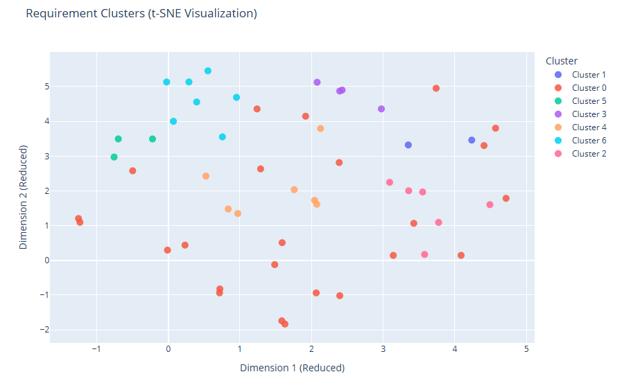
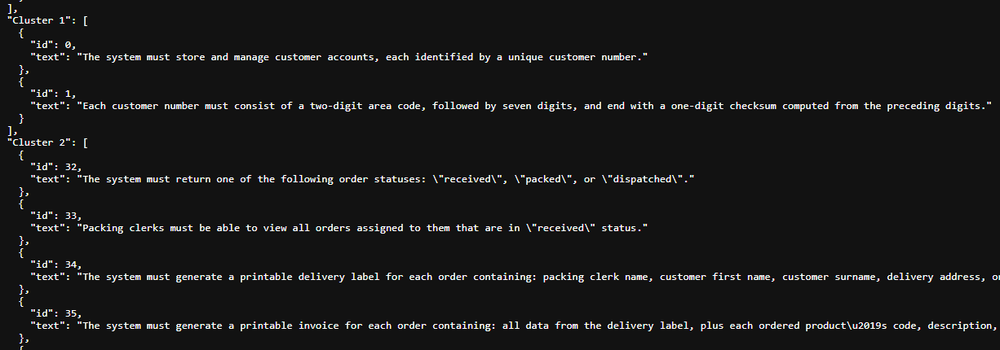

# Functional Requirements Clustering Pipeline

This project automates the extraction of architectural insights from functional requirements.



The pipeline automates:

- Embedding requirements into semantic vectors
- Clustering them to reveal cohesive functional groups
- Storing results in Qdrant for fast semantic search
- Visualizing clusters in 2D for exploration
- Serving results via a lightweight HTTP server

Designed for behavior-driven software architecture, it helps identify natural component boundaries (e.g. components or bounded contexts) from requirement text.



## 📦 Features

- **Flexible input**: Load functional requirements from `.txt` or `.json` files
- **Modern embeddings**: Uses `all-MiniLM-L6-v2` (384-dim sentence transformers) for semantic representation
- **Smart clustering**: HDBSCAN automatically detects cluster count and handles noise
- **Semantic search**: Store vectors and metadata in Qdrant for fast querying and filtering
- **Interactive visualization**: 2D scatter plots with hover details using Plotly
- **HTTP API**:
  - `/clusters.html` – Interactive cluster map
  - `/clusters.json` – Machine-readable cluster assignments
  - `/embeddings?limit=N&vector_len=M` – Inspect raw vectors  
    - **N** = number of embedding vectors to return  
    - **M** = length (dimensionality) of each embedding vector
- **Docker-ready**: Runs in containers alongside Qdrant for easy setup
## 🚀 Quick Start

### 1. Prepare Requirements File

Create `functional_requirements.txt` in app directory (one requirement per line):

```txt
The system must authenticate a customer using a customer number and a password.
The system must reject any order-related action for a customer who is blacklisted.
...
```

Or use JSON format (`requirements.json`):

```json
[
  "The system must authenticate...",
  "The system must reject..."
]
```

### 2. Run with Docker Compose
Build and run:
```bash
docker-compose up --build
```

### 3. Explore Results
```markdown
# Cluster visualization
http://localhost:8000/clusters.html

# Raw cluster data
http://localhost:8000/clusters.json

# Embedding samples
http://localhost:8000/embeddings?limit=5
```

## 🧠 Interpreting Results

### Cluster Quality

- Trust `clusters.json` over the 2D plot: Clustering happens in 384D; the plot is a visualization aid
- Large "catch-all" clusters often contain cross-cutting concerns (e.g., reporting, system replacement)
- Small, tight clusters indicate specialized subdomains (e.g., SMS parsing, blueprint ordering)

### Architectural Mapping

After clustering, you can manually assign meaningful names to each cluster to reflect candidate components or subdomains. This helps turn the automated clustering output into an actionable architecture blueprint.

Example mapping:

```json
{
  "CustomerIdentity": ["FR-1", "FR-2", "FR-56"],
  "ProductCatalog": ["FR-4", "FR-5", "FR-6"],
  "OrderIntake": ["FR-8", "FR-16", "FR-25-32"],
  "OtherClusters": []
}
```

### How to Manually Name Clusters

1. **Open** the `clusters.json` file generated by the pipeline.  
2. **Review** the functional requirements in each cluster.  
3. **Assign** a descriptive component name for each cluster, for example: `CustomerIdentity`, `OrderIntake`, `PaymentProcessing`.  
4. **Replace** the automatically generated cluster keys with your chosen names.  
5. **Save** this mapping. It can now be used as a reference for designing bounded contexts or modules.

### CLI Arguments

CLI arguments can be used by modifying the `docker-compose.yml` `app` service. Use the `command:` field to override the default script execution. For example:

```bash
python fr_clustering.py --help

- --print-fr                   : Print loaded requirements and exit
- --fr-file       PATH         : Override requirements file path
- --projection    [umap|tsne]  : Choose 2D projection method (default: tsne)
- --perplexity    FLOAT        : t-SNE perplexity (default: 30.0)
```

Usage in ``docker-compose.yaml``:

```yaml
# command: overrides the default CMD in the Dockerfile, allowing you to specify CLI arguments.
command: python fr_clustering.py --projection tsne --perplexity 5
```

>💡 Tip for small datasets (< 50 items): Use `--projection tsne --perplexity 5` for clearer local structure. 

## ⚙️ Configuration

### Environment Variables

| Variable | Default | Description |
|----------|---------|-------------|
| *QDRANT_HOST* | localhost | Qdrant service hostname |
| QDRANT_HTTP_PORT | 6333 | Qdrant HTTP API port |
| FR_FILE | functional_requirements.txt | Path to requirements file |
| LOG_LEVEL | INFO | Logging verbosity (DEBUG, INFO, WARNING) |

## 🛠️ Dependencies

See `requirements.txt` for full list.

## 📜 License

See [MIT License](LICENSE.md)
